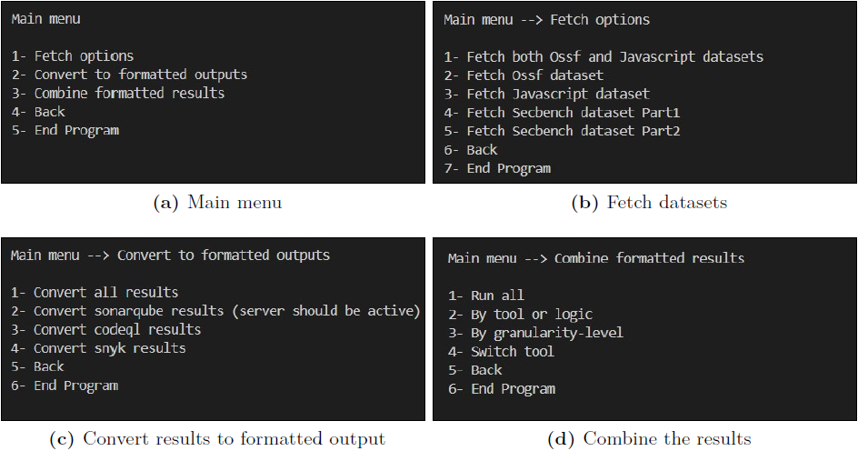

# SAST-Tools-Analyzer

## Overview

**SAST-Tools-Analyzer** is a command-line tool designed to automate the process of analyzing and comparing the results of different Static Application Security Testing (SAST) tools. The tool is capable of combining results from various SAST tools, applying logical operators like AND/OR, and computing performance metrics. It is primarily used for evaluating how well different SAST tools detect security vulnerabilities in codebases, offering a benchmarking process that helps improve security analysis workflows.

Developed as part of a thesis project, the tool allows users to download benchmark datasets, combine results from multiple SAST tools, and cross-check these results to compute true positives (TP), false positives (FP), and false negatives (FN), along with other important performance metrics.

The project is implemented in JavaScript, and the source code is divided into several modules, each serving a specific function in the analysis pipeline.

## Features

- **Automated Analysis**: Automates the complete workflow of analyzing SAST tools' results.
- **Combining Results**: Merges the results from multiple tools using AND/OR logic while handling duplicates.
- **Customizable**: Easily extendable to include more SAST tools.
- **Benchmarking**: Compares the tool results with predefined benchmark datasets.
- **Performance Metrics**: Calculates key performance metrics (TP, FP, FN, etc.) for individual and combined tool results.

  

## Project Structure

The tool consists of the following JavaScript files, along with the `package.json` and environment template files.

### Files

- **`package.json`**: Contains metadata, project dependencies, and scripts.
- **`environment-template`**: Provides instructions to set up the project environment.

### Core Functionality Files

- **`main.js`**: The entry point for the application, calling the command-line service to display a user menu.
- **`sonarqube.js`**: Interacts with the SonarQube server to fetch results via its API, converting SonarQube-specific output to a standard output format.
- **`codeql.js`**: Converts CodeQL-specific output to the standard output format used in this project.
- **`snyk.js`**: Handles conversion of Snyk’s output to the standard format and extracts severity information from Snyk’s logs.
- **`combiner.js`**: Combines results from different SAST tools using AND/OR logic and handles duplicates, ensuring accurate performance metrics.
- **`analyzer.js`**: Takes the combined results and compares them with benchmark datasets to compute performance metrics such as TPs, FPs, and FNs.
- **`ossf.js`**: Downloads the OpenSSF dataset for evaluation.
- **`javascriptDataset.js`**: Downloads the JavaScript dataset for evaluation.

### Utility and Supporting Files

- **`abstractSynTree.js`**: Converts source code into an abstract syntax tree (AST) and extracts function-level information (names, start/end line numbers).
- **`arrays.js`**: Provides utility functions for array manipulation, such as sorting and filtering.
- **`commandPrompt.js`**: Displays the command menu in the console and handles user actions like downloading datasets and processing tool results.
- **`cweProcessor.js`**: Calculates the weighted detection percentages for each Common Weakness Enumeration (CWE) detected by the tool.
- **`file.js`**: Contains file utility functions for merging JSON files, reading CSV files, etc.
- **`function.js`**: Constructs a hierarchical structure representing parent-child relationships between functions in the source code.
- **`http.js`**: Represents an HTTP service for sending requests to the SonarQube server or GitHub to download datasets.
- **`logger.js`**: A simple logging service for tracking application operations.
- **`text.js`**: Reads or deletes text at specific line numbers in a source file, helping to clean files for performance evaluation.
- **`timeData.js`**: Provides the current timestamp for logging and file naming purposes.

## Getting Started

### Prerequisites

- [Node.js](https://nodejs.org/) v18.20.3 or higher

### Installation

1. Clone the repository:
   ```bash
   git clone https://github.com/azeemabrarkhan/SAST-Tools-Analyzer.git
   cd SAST-Tools-Analyzer
   ```
   
2. Install dependencies:
    ```bash
   npm install
   ```

3. Usage
   To run the tool and display the command menu:
    ```bash
   npm start
   ```
   You will be presented with options to download datasets, convert results from different SAST tools, or combine the results using logical operators.
